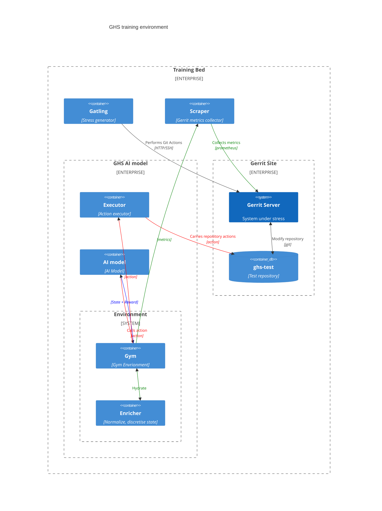

```mermaid
C4Context
  title GHS training environment
  Enterprise_Boundary(test_bed, "Training Bed", "Training bed") {
    Enterprise_Boundary(aimodel, "GHS AI model") {
        Container(executor, "Executor", "Action executor")
        System_Boundary(environment, "Environment", "Environment") {
            Container(gym, "Gym", "Gym Envrionment")
            Container(enricher, "Enricher", "Normalize, discretise state")
        }
        Container(model, "AI model", "AI Model")
    }
    Container(gatling, "Gatling", "Stress generator")
    Container(scraper, "Scraper", "Gerrit metrics collector")
    Enterprise_Boundary(site, "Gerrit Site") {
      System(gerrit, "Gerrit Server", "System under stress")
      ContainerDb(repository, "ghs-test", "Test repository")
    }
  }

  BiRel(gym, enricher, "Hydrate")
  UpdateRelStyle(gym, enricher, $textColor="green", $lineColor="green", $offsetX="-20", $offsetY="10")

  BiRel(gerrit, repository, "Modify repository", "jgit")

  Rel(gatling, gerrit, "Performs Git Actions", "HTTP/SSH")
  UpdateRelStyle(gatling, gerrit, $offsetX="-110", $offsetY="-50")

  Rel(scraper, gerrit, "Collects metrics", "prometheus")
  UpdateRelStyle(scraper, gerrit, $textColor="green", $lineColor="green", $offsetX="-70", $offsetY="-50")

  Rel(executor, repository, "Carries repository actions", "action")
  UpdateRelStyle(executor, repository, $textColor="red", $lineColor="red")

  Rel(model, gym, "Calls action", "action")
  UpdateRelStyle(model, gym, $textColor="red", $lineColor="red", $offsetY="65")

  Rel(gym, model, "", "State + Reward")
  UpdateRelStyle(gym, model, $textColor="blue", $lineColor="blue", $offsetX="-50", $offsetY="-40")

  Rel(gym, executor, "", "action")
  UpdateRelStyle(gym, executor, $textColor="red", $lineColor="red", $offsetY="-30")

  Rel(gym, scraper, "", "metrics")
  UpdateRelStyle(gym, scraper, $textColor="green", $lineColor="green", $offsetX="-30")

  UpdateLayoutConfig($c4ShapeInRow="3", $c4BoundaryInRow="2")
```